# AutoGen 기반 AI Agent 개발 가이드


## 1. AI Agent 개요

AI Agent는 환경을 인식하고, 목표를 달성하기 위해 자율적으로 행동하는 지능형 소프트웨어 시스템이다.
사용자의 명시적 지시 없이도 상황을 판단하고 적절한 행동을 선택할 수 있는 능력을 가지고 있다.


### 1.1 AI Agent 개념도

```mermaid
graph TD
    A[사용자 요청] --> B[AI Agent]
    B --> C[작업 분석]
    C --> D[계획 수립]
    D --> E[실행]
    E --> F[결과 검증]
    F --> G[사용자에게 응답]
    
    B --> H[도구 사용]
    B --> I[다른 Agent와 협력]
    B --> J[메모리 활용]
```



### 1.2 AI Agent의 특징

AI Agent는 단순한 챗봇을 넘어서 자율적으로 작업을 수행할 수 있는 지능형 시스템입니다.

**주요 특징:**

- **자율성(Autonomy)**: 사용자의 지시 없이도 목표 달성을 위해 독립적으로 행동
- **반응성(Reactivity)**: 환경 변화에 즉각적으로 반응하고 적응
- **능동성(Proactivity)**: 목표 달성을 위해 선제적으로 행동
- **사회성(Social Ability)**: 다른 Agent나 사용자와 상호작용

**활용 분야:**
- 코드 생성 및 리뷰 자동화
- 데이터 분석 및 리포트 생성
- 고객 서비스 및 지원
- 프로젝트 관리 및 협업

### 1.3 AI Agent 프레임워크 종류

| 프레임워크          | 특징 및 주요 기능                                            | 장점                                                         | 단점                                                         |
| ------------------- | ------------------------------------------------------------ | ------------------------------------------------------------ | ------------------------------------------------------------ |
| **AutoGen**         | - LLM 기반 멀티에이전트 - 대화/함수호출/코드 실행/그룹챗 지원 - 오픈소스(Microsoft) | - 대화형 멀티에이전트 구성 용이 - 코드 실행, 기능 확장성 - Retrieval/RAG 지원 | - 복잡한 커스텀 시나리오엔 코드 깊이 이해 필요 - 비교적 많은 설정값 |
| **LangChain**       | - 체인 기반 워크플로 - 다양한 LLM/DB/도구와 연동 - RAG 특화 - 도구 플러그인 다양 | - 도구·DB·API 연동 쉬움 - 문서/코드 검색 강점 - 플러그인 생태계 풍부 | - 체인 구성에 대한 러닝커브 - 복잡한 파이프라인은 디버깅 난이도↑ |
| **CrewAI**          | - 멀티에이전트 태스크포스 - LLM 역할 기반 협업 - 각 에이전트 행동 명확 | - 협업 시나리오 설계 쉬움 - 분업 구조 구현에 적합 - 직관적 에이전트 관리 | - 복잡한 RAG/검색 기능 상대적 제한 - 대규모 확장성은 제한적  |
| **MetaGPT**         | - 멀티에이전트 코드 자동 생성(특히 소프트웨어 개발 시나리오) - 역할분담(기획, 설계, QA, 실행 등) | - 개발 자동화에 강점 - 실무 소프트웨어 개발 협업 시나리오 우수 - 결과물 일관성 | - 범용 AI Workflow엔 한계 - 유연한 비판리적 분업은 어려움    |
| **Haystack Agents** | - 강력한 RAG 및 검색 특화 - 멀티모달, PDF 등 문서 분석 도구 - 다양한 Backend 연동 지원 | - 문서/검색/RAG 챗봇에 최적 - 엔터프라이즈 환경 연동 쉬움    | - 대화형 멀티에이전트 한계 - LLM 대응력은 LangChain/AutoGen에 비해 약함 |


---

## 2. AI 관련 용어 설명

### 2.1 핵심 용어 비교표

| 용어 | 정의 | 예시 | AutoGen에서의 역할 |
|------|------|------|-------------------|
| **LLM (Large Language Model)** | 대규모 언어 모델 | GPT-4, Claude, Gemini | Agent의 두뇌 역할 |
| **Prompt Engineering** | 효과적인 지시문 작성 기술 | "당신은 Python 전문가입니다..." | Agent 행동 정의 |
| **RAG (Retrieval-Augmented Generation)** | 외부 지식 검색 후 생성 | 문서 DB 검색 + 답변 생성 | 지식 확장 메커니즘 |
| **Function Calling** | 외부 함수/API 호출 | 파일 읽기, API 호출 | Tool 사용 능력 |
| **Multi-Agent System** | 여러 Agent 협력 시스템 | 개발자 + 테스터 + 리뷰어 | AutoGen의 핵심 개념 |
| **Conversation Flow** | 대화 흐름 제어 | 순차 → 병렬 → 조건부 실행 | Agent 간 상호작용 |

### 2.2 상세 설명

**LLM (Large Language Model)**
- 수십억 개의 매개변수를 가진 신경망 모델
- 자연어 이해와 생성 능력을 보유
- AutoGen에서 각 Agent의 추론 엔진 역할

**Prompt Engineering**

- Agent의 역할, 행동 방식, 출력 형식을 정의
- 시스템 프롬프트와 사용자 프롬프트로 구성
- 효과적인 프롬프트가 Agent 성능을 크게 좌우

**Multi-Agent System**
- 여러 전문화된 Agent가 협력하여 복잡한 작업 수행
- 각 Agent는 고유한 역할과 책임을 가짐
- 병렬 처리와 전문성 활용으로 효율성 증대

---


## 3. AutoGen 아키텍처 개요

### 3.1 AutoGen 이란?

Microsoft에서 개발한 AutoGen은 AI 에이전트를 구축하고 여러 에이전트 간의 협업을 통해 복잡한 작업을 해결할 수 있는 오픈소스 프로그래밍 프레임워크
사용자가 다양한 역할을 가진 에이전트들을 정의하고 이들 간의 상호작용을 설계함으로써 효율적인 AI 시스템을 구축할 수 있음


### 3.2 AutoGen 아키텍처 

AutoGen은 기본적으로 **AssistantAgent**와 **UserProxyAgent** 두 가지 에이전트를 제공.

- AssistantAgent는 LLM에 의해 구동되어 코딩과 같은 작업을 수행
- UserProxyAgent는 코드 실행기(code executor)를 통해 코드 블록이 포함된 메시지를 받아 실행하고 결과를 반환.

```mermaid
graph TB
    A[UserProxyAgent] -->|메시지 전송| B[AssistantAgent]
    B -->|응답 반환| A
    C[GroupChat Manager] -->|메시지 라우팅| D[Multiple Agents]
    D -->|협력| C
    
    subgraph "Agent Types"
        A
        B
    end
```



| 구성요소       | 역할               | 주요 기능                           |
| -------------- | ------------------ | ----------------------------------- |
| AssistantAgent | AI 어시스턴트      | LLM 기반 대화, 코드 생성, 문제 해결 |
| UserProxyAgent | 사용자 대리자      | 코드 실행, 사용자 입력 처리, 검증   |
| GroupChat      | 다중 에이전트 관리 | 여러 에이전트 간 협력, 대화 관리    |


### 3.3 AutoGen 시스템 구조도


### 3.4 AutoGen Workflow

여러 AI 에이전트가 협력하여 특정 목표나 작업을 자동화·완수하는 일련의 절차와 구조를 의미함.
단일 에이전트가 아닌, 다양한 역할을 가진 에이전트들이 서로 소통하고, 작업을 분담하며, 단계적으로 문제를 해결하는 과정을 말함.

- **다중 에이전트 협업**
  여러 에이전트(예: 사용자 프록시, 보조 에이전트, 도구 에이전트 등)가 각자의 역할에 따라 정보를 주고받으며 공동의 목표를 달성.
  예를 들어, 사용자의 질문을 받아 분석하는 에이전트, 코드를 작성하는 에이전트, 실행 결과를 검증하는 에이전트가 순차적으로 협력.
- **대화 기반 제어 흐름**
  워크플로우는 에이전트 간 메시지 교환(대화)로 정의됩니다. 각 에이전트는 메시지를 받고, 응답을 생성하며, 필요에 따라 다른 에이전트에게 작업을 위임.
- **자동화와 반복 개선**
  워크플로우는 단순한 작업 분배를 넘어, 자동화된 코드 실행, 오류 감지 및 반복적 개선(자기 복구)까지 포함합니다. 예를 들어, 코드 실행 결과가 기대와 다를 경우 에이전트가 자동으로 수정·재실행을 시도.
- **유연한 구조**
  워크플로우는 일대일, 계층적, 그룹 대화 등 다양한 구조로 설계할 수 있습니다. 복잡한 문제는 여러 하위 작업으로 쪼개어 각 에이전트에 분배하고, 결과를 통합해 최종 목표를 달성.
- **도구·API 연동**
  에이전트는 외부 API, 데이터베이스, 코드 실행기 등 다양한 도구와 연동되어 워크플로우 내에서 실제 작업을 수행할 수 있음


## 4. Agent별 상세 기능

### 4.1 AssistantAgent

#### AssistantAgent 개요

AssistantAgent는 대화형 AI 어시스턴트로, LLM을 기반으로 사용자의 질문에 답하고 코드를 생성하는 역할.

##### 주요 기능

- LLM 기반 추론 및 응답 생성
- 함수 호출 및 도구 사용 가능
- 컨텍스트 기반 대화 진행

```mermaid
graph LR
    A[사용자 입력] --> B[AssistantAgent]
    B --> C[LLM 처리]
    C --> D[응답 생성]
    D --> E[메시지 반환]
```



#### AssistantAgent 상세 설정

##### 기본 파라미터 설명

| 파라미터 | 타입 | 설명 | 기본값 |
|---------|------|------|--------|
| `name` | str | 에이전트 이름 | "assistant" |
| `system_message` | str | 시스템 메시지 (역할 정의) | None |
| `llm_config` | dict | LLM 설정 정보 | None |
| `max_consecutive_auto_reply` | int | 최대 연속 자동 응답 수 | None |
| `human_input_mode` | str | 사용자 입력 모드 | "TERMINATE" |


#### AssistantAgent 활용 실습

##### 기본 AssistantAgent 생성

```python
import os
from dotenv import load_dotenv
from autogen import AssistantAgent

# LLM 설정 구성
config_list_azure = [
    {
        "model": "deploy-gpt-4o-240806-01",
        "api_type": "azure",
        "base_url": "https://edutech-eastus.openai.azure.com/",
        "api_version": "2023-12-01-preview",
        "api_key": "" # 실제 키 사용 시 주의
    }
]
llm_config = {
    "cache_seed": 42, # 임의의 시드값
    "temperature": 0.7, # LLM 응답의 다양성 제어
    "config_list" : config_list_azure
} 

# AssistantAgent 생성
assistant = AssistantAgent(
    name="coding_assistant",  # 에이전트 이름
    system_message="""당신은 숙련된 Python 개발자입니다. 
    사용자의 코딩 질문에 명확하고 실용적인 답변을 제공하세요.
    코드 예제를 포함하여 설명해주세요.""",
    llm_config=llm_config,
    max_consecutive_auto_reply=3,  # 최대 3번까지 연속 응답
)

print("AssistantAgent가 성공적으로 생성되었습니다.")
```

##### 전문화된 AssistantAgent 생성

```python
# 코드 리뷰 전문 AssistantAgent
code_reviewer = AssistantAgent(
    name="code_reviewer",
    system_message="""당신은 코드 리뷰 전문가입니다.
    다음 관점에서 코드를 검토해주세요:
    1. 코드 품질 및 가독성
    2. 성능 최적화 가능성
    3. 보안상 문제점
    4. 베스트 프랙티스 준수 여부
    구체적인 개선 제안을 포함해주세요.""",
    llm_config=llm_config,
)

# 데이터베이스 전문 AssistantAgent
db_expert = AssistantAgent(
    name="database_expert",
    system_message="""당신은 데이터베이스 전문가입니다.
    SQL 쿼리 최적화, 데이터베이스 설계, 인덱싱 전략에 대해
    전문적인 조언을 제공합니다.
    Java/Python 환경에서의 데이터베이스 연동에 특화되어 있습니다.""",
    llm_config=llm_config,
)
```

##### 고급 설정을 포함한 AssistantAgent

```python
# 고급 설정이 적용된 AssistantAgent
advanced_assistant = AssistantAgent(
    name="advanced_coding_assistant",
    system_message="""당신은 KT의 백엔드 개발팀을 위한 AI 코딩 어시스턴트입니다.
    Java Spring Boot와 Python Django/FastAPI 프레임워크에 특화되어 있습니다.
    통신 서비스 도메인 지식을 바탕으로 실무적인 조언을 제공합니다.""",
    llm_config={
        **llm_config,
        "temperature": 0.3,  # 더 일관된 응답을 위해 낮은 temperature
        "top_p": 0.9,  # 응답 다양성 조절
        "frequency_penalty": 0.1,  # 반복 방지
    },
    max_consecutive_auto_reply=5,
    human_input_mode="NEVER",  # 사용자 개입 없이 자동 진행
)
```

---

### 4.2 UserProxyAgent

#### UserProxyAgent 개요

UserProxyAgent는 사용자를 대신하여 코드를 실행하고, 다른 에이전트와의 상호작용을 관리하는 역할.

#### 주요 기능

- 코드 실행 환경 제공
- 사용자 입력 처리
- 파일 시스템 접근
- 외부 도구 실행

```mermaid
graph TB
    A[UserProxyAgent] --> B[코드 실행]
    A --> C[사용자 입력 처리]
    A --> D[다른 Agent와 통신]
    B --> E[실행 결과 반환]
    C --> F[입력 검증]
    D --> G[메시지 라우팅]
```



#### UserProxyAgent 상세 설정

##### 기본 파라미터 설명

| 파라미터 | 타입 | 설명 | 기본값 |
|---------|------|------|--------|
| `name` | str | 에이전트 이름 | "userproxy" |
| `human_input_mode` | str | 사용자 입력 모드 | "ALWAYS" |
| `code_execution_config` | dict | 코드 실행 설정 | None |
| `max_consecutive_auto_reply` | int | 최대 연속 자동 응답 수 | None |
| `is_termination_msg` | function | 종료 메시지 판단 함수 | None |

##### 코드 실행 설정 파라미터

| 파라미터 | 타입 | 설명 |
|---------|------|------|
| `work_dir` | str | 작업 디렉토리 경로 |
| `use_docker` | bool | Docker 사용 여부 |
| `timeout` | int | 실행 타임아웃 (초) |
| `last_n_messages` | int | 저장할 최근 메시지 수 |

##### UserProxyAgent 활용 실습
###### 코드 실행 전문 UserProxyAgent

```python
# 코드 실행에 특화된 UserProxyAgent
code_executor = UserProxyAgent(
    name="code_executor",
    system_message="""코드 실행 전문 에이전트입니다.
    안전하고 효율적인 코드 실행을 담당합니다.""",
    human_input_mode="NEVER",  # 사용자 입력 없이 자동 실행
    max_consecutive_auto_reply=15,
    code_execution_config={
        "work_dir": work_dir,
        "use_docker": False,
        "timeout": 120,  # 더 긴 타임아웃
        "last_n_messages": 5,  # 더 많은 메시지 저장
    },
    # 커스텀 종료 조건
    is_termination_msg=lambda msg: "작업 완료" in msg.get("content", "") or 
                                   "TERMINATE" in msg.get("content", "")
)

messages = [{"role": "user", "content": "```bash\nls -al\n```"}]

#실행 및 결과 확인
response = user_proxy.generate_reply(message)
print(response)


```

###### AssistantAgent와 UserProxyAgent 연동 실습

```python
# 두 에이전트를 연동한 간단한 대화 시스템
def run_assistant_user_chat():
    """AssistantAgent와 UserProxyAgent 간의 대화 실행"""
    
    # 이전에 생성한 assistant와 user_proxy 사용
    try:
        # 대화 시작
        user_proxy.initiate_chat(
            assistant,
            message="""Python으로 간단한 계산기 클래스를 만들어주세요.
            다음 기능이 포함되어야 합니다:
            1. 사칙연산 (덧셈, 뺄셈, 곱셈, 나눗셈)
            2. 계산 이력 저장
            3. 이력 조회 기능
            
            코드를 작성한 후 간단한 테스트도 실행해주세요."""
        )
        
    except Exception as e:
        print(f"대화 실행 중 오류 발생: {e}")

# 실행
if __name__ == "__main__":
    run_assistant_user_chat()
```

---

### 4.3 GroupChat

#### GroupChat 개요

GroupChat은 여러 에이전트들이 함께 참여하는 다중 에이전트 대화 시스템입니다. 복잡한 문제를 여러 전문가 에이전트들이 협력하여 해결.

#### 주요 기능

- GroupChat은 **에이전트 리스트, 메시지 기록, 발화자 선택 방법, 전이 제약 등**을 관리합니다.
- GroupChatManager는 **GroupChat의 진행, 발화자 선택, LLM 활용, 종료 조건 관리** 등을 담당합니다.

```mermaid
graph TB
    A[GroupChatManager] --> B[Agent 1: 코드 생성자]
    A --> C[Agent 2: 코드 리뷰어]
    A --> D[Agent 3: 테스터]
    A --> E[Agent 4: 문서 작성자]
    
    B --> F[협력 작업]
    C --> F
    D --> F
    E --> F
    
    F --> G[최종 결과]
```



#### GroupChat 상세 설정

##### GroupChat 파라미터 설명

| 파라미터 | 타입 | 설명 | 기본값 |
|---------|------|------|--------|
| `agents` | list | 참여할 에이전트 리스트 | [] |
| `messages` | list | 대화 메시지 리스트 | [] |
| `max_round` | int | 최대 대화 라운드 수 | 10 |
| `admin_name` | str | 관리자 이름 | "Admin" |
| `func_call_filter` | bool | 함수 호출 필터링 | True |

##### GroupChatManager 파라미터 설명

| 파라미터 | 타입 | 설명 |
|---------|------|------|
| `groupchat` | GroupChat | 관리할 그룹챗 객체 |
| `name` | str | 매니저 이름 |
| `llm_config` | dict | LLM 설정 |

##### GroupChat 활용 실습

```python
from autogen import GroupChat, GroupChatManager, AssistantAgent, UserProxyAgent

config_list_azure = [
    {
        "model": "deploy-gpt-4o-240806-01",
        "api_type": "azure",
        "base_url": "https://edutech-eastus.openai.azure.com/",
        "api_version": "2023-12-01-preview",
        "api_key": "" # 실제 키 사용 시 주의
    }
]
llm_config = {
    "cache_seed": 42, # 임의의 시드값
    "temperature": 0.7, # LLM 응답의 다양성 제어
    "config_list" : config_list_azure
}    

# 다양한 역할의 에이전트들 생성
agents_list = []

# 1. 요구사항 분석가
requirement_analyst = AssistantAgent(
    name="requirement_analyst",
    system_message="""당신은 요구사항 분석 전문가입니다.
    사용자의 요구사항을 명확히 분석하고 구체적인 기능 명세를 작성합니다.
    기술적 제약사항과 비즈니스 요구사항을 모두 고려합니다.""",
    llm_config=llm_config,
)
agents_list.append(requirement_analyst)

# 2. 아키텍트
architect = AssistantAgent(
    name="architect",
    system_message="""당신은 소프트웨어 아키텍트입니다.
    시스템 설계와 기술 스택 선택을 담당합니다.
    확장 가능하고 유지보수가 용이한 아키텍처를 설계합니다.""",
    llm_config=llm_config,
)
agents_list.append(architect)

# 3. 개발자
developer = AssistantAgent(
    name="developer",
    system_message="""당신은 풀스택 개발자입니다.
    Java Spring Boot와 Python을 주로 사용하며,
    클린 코드와 테스트 가능한 코드 작성에 중점을 둡니다.""",
    llm_config=llm_config,
)
agents_list.append(developer)

# 4. 테스터
tester = AssistantAgent(
    name="tester",
    system_message="""당신은 QA 테스터입니다.
    코드의 품질을 검증하고 다양한 테스트 케이스를 작성합니다.
    단위 테스트, 통합 테스트, 성능 테스트를 담당합니다.""",
    llm_config=llm_config,
)
agents_list.append(tester)

# 5. UserProxyAgent (실행자)
executor = UserProxyAgent(
    name="executor",
    system_message="코드 실행과 결과 검증을 담당합니다.",
    human_input_mode="TERMINATE",
    max_consecutive_auto_reply=2,
    code_execution_config={
        "work_dir": work_dir,
        "use_docker": False,
        "timeout": 60,
    },
)
agents_list.append(executor)

print(f"총 {len(agents_list)}개의 에이전트가 생성되었습니다.")

# GroupChat 생성
group_chat = GroupChat(
    agents=agents_list,
    messages=[],
    max_round=20,  # 최대 20라운드 대화
    admin_name="Project_Manager",  # 프로젝트 매니저 역할
)

# GroupChatManager 생성
chat_manager = GroupChatManager(
    groupchat=group_chat,
    name="chat_manager",
    llm_config=llm_config,
    system_message="""당신은 프로젝트 매니저입니다.
    팀원들의 대화를 조율하고 프로젝트가 효율적으로 진행되도록 관리합니다.
    각 에이전트의 전문성을 최대한 활용하여 최적의 결과를 도출합니다."""
)

print("GroupChat과 ChatManager가 성공적으로 생성되었습니다.")

def run_group_project():
    """그룹 에이전트들이 협력하여 프로젝트 수행"""
    
    project_description = """
    KT 내부용 직원 출입 관리 시스템을 개발해주세요.
    
    요구사항:
    1. 직원 정보 관리 (CRUD)
    2. 출입 기록 저장 및 조회
    3. 실시간 출입 현황 모니터링
    4. 보안 등급별 접근 제어
    5. REST API 제공
    6. 관리자 대시보드
    
    기술 제약사항:
    - Backend: Java Spring Boot 사용
    - Database: PostgreSQL
    - 인증: JWT 토큰 기반
    - 문서화: Swagger UI 포함
    
    각 팀원은 자신의 전문 분야에서 기여해주세요.
    """
    
    try:
        # 프로젝트 시작
        executor.initiate_chat(
            chat_manager,
            message=project_description
        )
        
    except Exception as e:
        print(f"그룹 프로젝트 실행 중 오류: {e}")

# 실행
if __name__ == "__main__":
    run_group_project()
```

### 4.4 함수 호출 (Function Calling)

Agent가 외부 도구나 API를 사용할 수 있도록 하는 기능.

- **함수(도구)는 UserProxyAgent와 AssistantAgent 모두에서 등록할 수 있지만, 실제 실행은 UserProxyAgent에서 담당하는 것이 표준적**.
- LLM이 함수 호출이 필요하다고 판단하면 AssistantAgent가 요청을 생성하고, UserProxyAgent가 실제로 실행
- 복잡한 워크플로우에서는 여러 에이전트가 역할을 분담하며, function_map은 주로 UserProxyAgent에 집중적으로 등록·관리

| 에이전트 종류    | function(도구) 등록 | 실제 함수 실행 | 주요 활용 시나리오                |
| ---------------- | ------------------- | -------------- | --------------------------------- |
| UserProxyAgent   | O                   | O              | 코드 실행, 외부 함수/도구 호출    |
| AssistantAgent   | O                   | X (권장)       | LLM의 함수 호출 요청 생성         |
| ConversableAgent | O                   | X (일반적)     | 커스텀 에이전트 확장 시 활용 가능 |


#### 함수 등록 

- 함수명(키)은 LLM 프롬프트와 정확히 일치해야 하며, 함수 시그니처(인자명 등)도 LLM이 이해할 수 있게 명확히 작성해야 함.
- 함수의 docstring(문서 문자열)은 LLM이 함수 사용법을 추론하는 데 사용.

##### 정적등록

Agent 생성 시 function_map 매개변수에 에 함수명을 키로, 함수 객체를 값으로 Dictionay 형태로 등록.

##### 동적등록

| 구분                       | 용도                                                         | 대상 에이전트(주로)           | 동작 방식 및 목적                                            | 주요 특징/차이점                                             |
| -------------------------- | ------------------------------------------------------------ | ----------------------------- | ------------------------------------------------------------ | ------------------------------------------------------------ |
| **register_for_execution** | 실제 함수(도구) 실행을 담당할 함수 객체를 등록               | UserProxyAgent, 실행 주체     | LLM이 함수 호출을 요청하면, 이 함수가 실제로 실행되어 결과를 반환 | - 실제 코드 실행 담당 - 함수의 로직이 여기서 실행됨 - 주로 UserProxyAgent(사용자 대리 에이전트)에 등록 |
| **register_for_llm**       | LLM이 함수(도구) 호출을 인식하고, 프롬프트에서 사용할 수 있도록 시그니처/설명 등록 | AssistantAgent, LLM 호출 주체 | LLM이 어떤 함수/도구를 언제 쓸 수 있는지 이해하도록 함수명, 설명, 시그니처를 등록 | - LLM이 함수 사용을 "결정"하는 역할 - 함수 실행은 하지 않음 - 주로 AssistantAgent(도우미 에이전트)에 등록 |


#### 함수 등록 예시

```python
import json
import requests

def search_documentation(query: str, language: str = "python") -> str:
    """
    온라인 문서에서 정보를 검색합니다.
    
    Args:
        query (str): 검색할 키워드
        language (str): 프로그래밍 언어
    
    Returns:
        str: 검색 결과
    """
    # 실제 검색 로직 (예시)
    return f"{language}에서 '{query}'에 대한 문서 정보입니다."

def execute_code_analysis(code: str) -> dict:
    """
    코드 분석을 수행합니다.
    
    Args:
        code (str): 분석할 코드
    
    Returns:
        dict: 분석 결과
    """
    return {
        "lines": len(code.split('\n')),
        "complexity": "Medium",
        "suggestions": ["변수명 개선", "주석 추가"]
    }

# Agent에 함수 등록(동적)
code_generator.register_for_execution(name="search_documentation")(search_documentation)
code_generator.register_for_llm(name="search_documentation", description="문서 검색 함수")(search_documentation)

code_reviewer.register_for_execution(name="execute_code_analysis")(execute_code_analysis)
code_reviewer.register_for_llm(name="execute_code_analysis", description="코드 분석 함수")(execute_code_analysis)

# function_map 생성(정적)
function_map = {
    "search_documentation": search_documentation
    "execute_code_analysis": execute_code_analysis
}
# Agent 생성 시 함수 등록
agent = AssistantAgent(
    #기존코드
    function_map=function_map
)
```


### 4.5 llm_config 

각 에이전트가 사용할 **대형 언어 모델(LLM)의 종류, 연결 정보, 파라미터(창의성, 응답 길이 등)**를 지정하는 핵심 설정.
각 에이전트가 어떤 LLM을 기반으로, 어떤 방식으로 응답을 생성할지 세밀하게 제어.

| 파라미터          | 타입/범위        | 기본값 | 설명                                        |
| ----------------- | ---------------- | ------ | ------------------------------------------- |
| config_list       | List[dict]       | 필수   | 사용할 LLM 설정 리스트                      |
| temperature       | float (0.0~1.0)  | 0.7    | 샘플링 온도(창의성/결정성 조절)             |
| max_tokens        | int              | 1024   | 최대 출력 토큰 수                           |
| timeout           | int              | 60     | API 요청 타임아웃(초)                       |
| cache_seed        | int/None         | 42     | 캐시 시드                                   |
| model             | str              | 필수   | 모델명(config_list 내)                      |
| api_key           | str              | 필수   | API 키(config_list 내)                      |
| base_url          | str              | None   | API 엔드포인트 URL(config_list 내)          |
| api_type          | str              | None   | API 유형(config_list 내)                    |
| api_version       | str              | None   | API 버전(config_list 내, Azure 등에서 필수) |
| top_p             | float (0.0~1.0)  | 1.0    | 누클리어스 샘플링(다양성 조절)              |
| frequency_penalty | float (-2.0~2.0) | 0.0    | 반복 억제(동일 단어/문장 반복 방지)         |
| presence_penalty  | float (-2.0~2.0) | 0.0    | 새 토큰 사용 장려(창의성 증가)              |
| stop              | str/list         | None   | 출력 중단 시퀀스 지정                       |
| user              | str              | None   | 사용자 식별자(로그/감사용)                  |
| stream            | bool             | False  | 스트리밍 응답 사용 여부                     |


### 4.6 기본 AutoGen 예제

#### 간단한 대화 예제

```python
# basic_example.py
import os
from autogen import ConversableAgent

# 환경 변수 설정 (실제 API 키로 교체 필요)
os.environ["OPENAI_API_KEY"] = "your-openai-api-key"

def main():
    """기본 AutoGen 예제"""
    
    # LLM 설정
    config_list_azure = [
        {
            "model": "deploy-gpt-4o-240806-01",
            "api_type": "azure",
            "base_url": "https://edutech-eastus.openai.azure.com/",
            "api_version": "2023-12-01-preview",
            "api_key": "" # 실제 키 사용 시 주의
        }
    ]
    llm_config = {
        "cache_seed": 42, # 임의의 시드값
        "temperature": 0.7, # LLM 응답의 다양성 제어
        "config_list" : config_list_azure
    } 
    
    # AI 어시스턴트 Agent
    assistant = ConversableAgent(
        name="assistant",
        system_message="당신은 도움이 되는 AI 어시스턴트입니다. 친절하고 정확한 답변을 제공합니다.",
        llm_config=llm_config,
        human_input_mode="NEVER"
    )
    
    # 사용자 대리 Agent
    user_proxy = ConversableAgent(
        name="user_proxy",
        system_message="사용자를 대신하여 질문하고 응답을 받습니다.",
        llm_config=None,  # LLM 사용하지 않음
        human_input_mode="ALWAYS"  # 항상 사용자 입력 받음
    )
    
    # 대화 시작
    print("AutoGen 기본 대화 예제")
    print("종료하려면 'exit' 또는 'quit'을 입력하세요.")
    
    user_proxy.initiate_chat(
        assistant,
        message="안녕하세요! AutoGen에 대해 간단히 설명해주세요."
    )

if __name__ == "__main__":
    main()
```


## 5. 고급 활용 시나리오

### 5.1 코드 생성 파이프라인
```python
from autogen import GroupChat, GroupChatManager, AssistantAgent, UserProxyAgent

class CodeGenerationPipeline:
    """코드 생성을 위한 전문화된 파이프라인"""
    config_list_azure = [
        {
            "model": "deploy-gpt-4o-240806-01",
            "api_type": "azure",
            "base_url": "https://edutech-eastus.openai.azure.com/",
            "api_version": "2023-12-01-preview",
            "api_key": "a634b87afef5450e8b3a6e729a809c5f" # 실제 키 사용 시 주의
        }
    ]
    llm_config = {
        "cache_seed": None, # 임의의 시드값
        "temperature": 0.8, # LLM 응답의 다양성 제어
        "config_list" : config_list_azure
    } 
    
    def __init__(self):
        self.setup_agents()
    
    def setup_agents(self):
     
        # 실행 에이전트
        self.executor = UserProxyAgent(
            name="code_executor",
            human_input_mode="NEVER",
            max_consecutive_auto_reply=3,
            code_execution_config={
                "work_dir": "./workspace",
                "use_docker": False,
                "timeout": 120,
                "last_n_messages": 5,           
            },
        )
    
    def generate_code(self, requirements):
        """코드 생성 파이프라인 실행"""
        
        print("=== 코드 생성 파이프라인 시작 ===")
        
        # 각 단계별로 별도 에이전트 생성하되 컨텍스트 주입
        accumulated_context = f"=== 프로젝트 요구사항 ===\n{requirements}\n\n"
        
        # 1단계: 요구사항 분석
        print("\n1단계: 요구사항 분석")
        analyst = self._create_context_agent("requirements_analyst", accumulated_context)
        
        stage1_result = self.executor.initiate_chat(
            analyst,
            message="요구사항 분석을 수행해주세요.",
            max_turns=2
        )
        
        stage1_content = self._extract_response_content(stage1_result)
        accumulated_context += f"=== 1단계: 요구사항 분석 결과 ===\n{stage1_content}\n\n"
        
        # 2단계: 아키텍처 설계
        print("\n2단계: 아키텍처 설계")
        architect = self._create_context_agent("system_architect", accumulated_context)
        
        stage2_result = self.executor.initiate_chat(
            architect,
            message="앞의 요구사항 분석을 바탕으로 시스템 아키텍처를 설계해주세요.",
            max_turns=2
        )
        
        stage2_content = self._extract_response_content(stage2_result)
        accumulated_context += f"=== 2단계: 아키텍처 설계 결과 ===\n{stage2_content}\n\n"
        
        # 3단계: 코드 구현
        print("\n3단계: 코드 구현")
        coder = self._create_context_agent("senior_developer", accumulated_context)
        
        stage3_result = self.executor.initiate_chat(
            coder,
            message="""앞의 설계를 바탕으로 완전한 코드를 구현해주세요.
            소스코드는 간단해야 합니다.
            실행을 위한 Python 가상환경은 만들지 않습니다.
            """,
            max_turns=2
        )
        
        stage3_content = self._extract_response_content(stage3_result)
        accumulated_context += f"=== 3단계: 코드 구현 결과 ===\n{stage3_content}\n\n"
        
        # 4단계: 코드 리뷰
        print("\n4단계: 코드 리뷰")
        reviewer = self._create_context_agent("code_reviewer", accumulated_context)
        
        stage4_result = self.executor.initiate_chat(
            reviewer,
            message="구현된 코드를 리뷰하고 개선점을 제시해주세요.",
            max_turns=2
        )
        
        stage4_content = self._extract_response_content(stage4_result)
        accumulated_context += f"=== 4단계: 코드 리뷰 결과 ===\n{stage4_content}\n\n"
        
        # 5단계: 테스트 작성
        print("\n5단계: 테스트 작성")
        tester = self._create_context_agent("test_engineer", accumulated_context)
        
        stage5_result = self.executor.initiate_chat(
            tester,
            message="최종 코드에 대한 포괄적인 테스트케이스를 작성해주세요.",
            max_turns=2
        )
        
        print("\n=== 컨텍스트 주입 방식 완료 ===")
        
        return {
            "analysis": stage1_result,
            "design": stage2_result,
            "code": stage3_result,
            "review": stage4_result,
            "tests": stage5_result,
            "full_context": accumulated_context
        }
        
    def _create_context_agent(self, role: str, context: str):
        """컨텍스트가 주입된 에이전트 생성"""
        
        role_prompts = {
            "requirements_analyst": """당신은 소프트웨어 요구사항 분석 전문가입니다.
            주어진 컨텍스트를 바탕으로 요구사항을 분석합니다.""",
            
            "system_architect": """당신은 시스템 아키텍트입니다.
            주어진 요구사항 분석 결과를 바탕으로 시스템 아키텍처를 설계합니다.""",
            
            "senior_developer": """당신은 10년 경력의 시니어 개발자입니다.
            주어진 설계를 바탕으로 완전한 코드를 구현합니다.
            """,
                        
            "code_reviewer": """당신은 코드 리뷰 전문가입니다.
            주어진 코드를 검토하고 개선점을 제시합니다.""",
            
            "test_engineer": """당신은 테스트 엔지니어입니다.
            주어진 코드에 대한 포괄적인 테스트를 작성합니다."""
        }
        
        system_message = f"""
        {role_prompts.get(role, "전문가")}
        
        === 현재까지의 프로젝트 컨텍스트 ===
        {context}
        
        위 컨텍스트를 바탕으로 작업을 수행해주세요.
        이전 단계의 결과를 반드시 참고하여 일관성 있는 결과를 제공하세요.
        """
        
        return AssistantAgent(
            name=role,
            system_message=system_message,
            llm_config=self.llm_config
        )
        
    def _extract_response_content(self, chat_result):
        """채팅 결과에서 응답 내용 추출"""
        try:
            if hasattr(chat_result, 'chat_history') and chat_result.chat_history:
                # 가장 마지막 AI 응답 찾기
                for message in reversed(chat_result.chat_history):
                    if message.get('role') == 'assistant':
                        return message.get('content', '')
            return str(chat_result)
        except:
            return str(chat_result)

# 파이프라인 사용 예시
def run_code_generation_pipeline():
    """코드 생성 파이프라인 실행 예시"""
    
    pipeline = CodeGenerationPipeline()
    
    sample_requirements = """
    KT 내부 직원용 간단한 할일 관리 시스템을 개발해주세요.
    
    기능 요구사항:
    1. 사용자 인증 (로그인/로그아웃)
    2. 할일 CRUD (생성, 조회, 수정, 삭제)
    3. 할일 카테고리 분류
    4. 마감일 설정 및 알림
    5. 할일 상태 관리 (대기, 진행중, 완료)
    6. 간단한 대시보드
    
    기술 요구사항:
    - Language : Python
    - Backend: Fast Api
    - Database: H2 (개발용)
    - API: RESTful API
    - Operation System: Linux

    비기능 요구사항:
    - 응답시간 < 200ms
    - 동시 사용자 100명 지원
    - 보안 등급: 중간
    """
    
    try:
        results = pipeline.generate_code(sample_requirements)
        print("\n파이프라인 실행이 완료되었습니다.")
        
    except Exception as e:
        print(f"파이프라인 실행 중 오류: {e}")

if __name__ == "__main__":
    run_code_generation_pipeline()
```

### 5.2 코드 리뷰 시스템
```python
from autogen import GroupChat, GroupChatManager, AssistantAgent, UserProxyAgent

class CodeReviewSystem:
    """다중 에이전트 코드 리뷰 시스템"""
    
    config_list_azure = [
        {
            "model": "deploy-gpt-4o-240806-01",
            "api_type": "azure",
            "base_url": "https://edutech-eastus.openai.azure.com/",
            "api_version": "2023-12-01-preview",
            "api_key": "a634b87afef5450e8b3a6e729a809c5f" # 실제 키 사용 시 주의
        }
    ]
    llm_config = {
        "cache_seed": None, # 임의의 시드값
        "temperature": 0.8, # LLM 응답의 다양성 제어
        "config_list" : config_list_azure
    } 
        
    def __init__(self):
        self.setup_review_agents()
    
    def setup_review_agents(self):
        """코드 리뷰 전문 에이전트들 설정"""
        
        # 보안 리뷰어
        self.security_reviewer = AssistantAgent(
            name="security_specialist",
            system_message="""당신은 보안 전문가입니다.
            코드의 보안 취약점을 찾아 제거하는 것이 주 임무입니다.
            
            검토 항목:
            1. SQL Injection 방지
            2. XSS 방지
            3. 인증/인가 검증
            4. 입력 데이터 검증
            5. 민감 정보 노출 방지
            6. 암호화 적용 여부
            
            OWASP Top 10 기준으로 검토해주세요.
            """,
            llm_config=self.llm_config,
        )
        
        # 성능 리뷰어
        self.performance_reviewer = AssistantAgent(
            name="performance_specialist",
            system_message="""당신은 성능 최적화 전문가입니다.
            코드의 성능 이슈를 찾아 개선 방안을 제시합니다.
            
            검토 항목:
            1. 알고리즘 복잡도
            2. 데이터베이스 쿼리 최적화
            3. 메모리 사용량
            4. 캐싱 전략
            5. 비동기 처리 가능성
            6. 리소스 누수 방지
            
            구체적인 성능 개선 코드를 제공해주세요.
            """,
            llm_config=self.llm_config,
        )
        
        # 아키텍처 리뷰어
        self.architecture_reviewer = AssistantAgent(
            name="architecture_specialist",
            system_message="""당신은 소프트웨어 아키텍처 전문가입니다.
            코드의 구조적 품질을 평가합니다.
            
            검토 항목:
            1. SOLID 원칙 준수
            2. 디자인 패턴 적용
            3. 모듈화 및 결합도
            4. 확장성 및 유지보수성
            5. 레이어 분리
            6. 의존성 관리
            
            리팩토링 제안을 포함해주세요.
            """,
            llm_config=self.llm_config,
        )
        
        # 코드 품질 리뷰어
        self.quality_reviewer = AssistantAgent(
            name="quality_specialist",
            system_message="""당신은 코드 품질 전문가입니다.
            코드의 가독성과 유지보수성을 평가합니다.
            
            검토 항목:
            1. 네이밍 컨벤션
            2. 코드 중복 제거
            3. 메서드 길이 및 복잡도
            4. 주석 및 문서화
            5. 예외 처리
            6. 코딩 스타일 일관성
            
            클린 코드 원칙을 기준으로 검토해주세요.
            """,
            llm_config=self.llm_config,
        )
        
        # 리뷰 통합자
        self.review_coordinator = UserProxyAgent(
            name="review_coordinator",
            human_input_mode="NEVER",
            max_consecutive_auto_reply=2,
            code_execution_config=False
        )
    
    def comprehensive_review(self, code_content):
        """종합적인 코드 리뷰 수행"""
        
        print("=== 멀티 에이전트 코드 리뷰 시작 ===")
        
        review_results = {}
        
        # 각 전문가별 리뷰 수행
        reviewers = [
            ("보안", self.security_reviewer),
            ("성능", self.performance_reviewer),
            ("아키텍처", self.architecture_reviewer),
            ("품질", self.quality_reviewer)
        ]
        
        for review_type, reviewer in reviewers:
            print(f"\n{review_type} 리뷰 진행 중...")
            
            review_prompt = f"""
다음 코드를 {review_type} 관점에서 리뷰해주세요:
'''
{code_content}
'''

구체적인 개선 제안과 수정 코드를 포함해주세요.
            """
            
            try:
                result = self.review_coordinator.initiate_chat(
                    reviewer,
                    message=review_prompt,
                    max_turns=2
                )
                review_results[review_type] = result
                
            except Exception as e:
                print(f"{review_type} 리뷰 중 오류: {e}")
                review_results[review_type] = f"리뷰 실패: {e}"
        
        # 종합 리뷰 결과 생성
        self.generate_final_report(review_results)
        
        return review_results
    
    def generate_final_report(self, review_results):
        """최종 리뷰 보고서 생성"""
        
        print("\n=== 종합 리뷰 보고서 ===")
        
        for review_type, result in review_results.items():
            print(f"\n【{review_type} 리뷰 결과】")
            print("-" * 30)
            # 결과 요약 출력 (실제로는 result 파싱 필요)
            print(f"{review_type} 리뷰가 완료되었습니다.")
        
        print("\n=== 리뷰 완료 ===")

# 리뷰 시스템 사용 예시
def run_code_review_system():
    """코드 리뷰 시스템 실행 예시"""
    
    review_system = CodeReviewSystem()
    
    sample_code = """
@RestController
@RequestMapping("/api/users")
public class UserController {
    
    @Autowired
    private UserService userService;
    
    @GetMapping("/{id}")
    public ResponseEntity<User> getUser(@PathVariable String id) {
        User user = userService.findById(id);
        if (user != null) {
            return ResponseEntity.ok(user);
        }
        return ResponseEntity.notFound().build();
    }
    
    @PostMapping
    public ResponseEntity<User> createUser(@RequestBody User user) {
        User savedUser = userService.save(user);
        return ResponseEntity.ok(savedUser);
    }
    
    @GetMapping
    public List<User> getAllUsers() {
        return userService.findAll();
    }
}
    """
    
    try:
        review_system.comprehensive_review(sample_code)
        
    except Exception as e:
        print(f"코드 리뷰 시스템 실행 중 오류: {e}")

if __name__ == "__main__":
    run_code_review_system()
```


### 5.3 챗봇 서비스

#### 전체 시스템 아키텍처

```mermaid
graph TD
    A[사용자 요청] --> B[FastAPI 서버]
    B --> C[AutoGen Agent Manager]
    C --> D[UserProxy Agent]
    C --> E[Assistant Agent]
    D --> F[OpenAI GPT API]
    E --> F
    F --> G[AI 응답 생성]
    G --> H[응답 처리]
    H --> B
    B --> I[JSON 응답 반환]
    
    style A fill:#e1f5fe
    style B fill:#f3e5f5
    style C fill:#e8f5e8
    style F fill:#fff3e0
    style I fill:#fce4ec
```



#### 시스템 컴포넌트 구성표

| 컴포넌트            | 역할                          | 기술 스택              | 포트/설정    |
| ------------------- | ----------------------------- | ---------------------- | ------------ |
| **FastAPI 서버**    | REST API 엔드포인트 제공      | FastAPI 0.104+         | 8000         |
| **AutoGen Manager** | AI Agent 관리 및 대화 조율    | pyautogen 0.9.0        | -            |
| **UserProxy Agent** | 사용자 입력 처리 및 대화 관리 | AutoGen UserProxyAgent | -            |
| **Assistant Agent** | AI 응답 생성 및 질문 처리     | AutoGen AssistantAgent | -            |
| **OpenAI API**      | 대화형 AI 모델 서비스         | GPT-4/GPT-3.5-turbo    | API Key 필요 |
| **프론트엔드**      | 간단한 웹 채팅 인터페이스     | HTML/JavaScript        | -            |

------

#### AutoGen Agent 구성

```python
# agents/simple_agents.py
import os
import json
import asyncio
from typing import Dict, Any, List, Optional
from dotenv import load_dotenv
import autogen
from autogen import UserProxyAgent, AssistantAgent

config_list_azure = [
        {
            "model": "deploy-gpt-4o-240806-01",
            "api_type": "azure",
            "base_url": "https://edutech-eastus.openai.azure.com/",
            "api_version": "2023-12-01-preview",
            "api_key": "a634b87afef5450e8b3a6e729a809c5f" # 실제 키 사용 시 주의
        }
    ]
llm_config = {
    "cache_seed": None, # 임의의 시드값
    "temperature": 0.8, # LLM 응답의 다양성 제어
    "config_list" : config_list_azure
}

class SimpleChatbotManager:
    """간단한 채팅봇 Agent 관리 클래스"""
    
    def __init__(self):
        self.user_proxy = None
        self.assistant = None
        self._initialize_agents()
    
    def _initialize_agents(self):
        """Agent 초기화"""
        try:
            # UserProxy Agent 생성
            # 사용자의 입력을 받고 대화를 관리하는 역할
            self.user_proxy = UserProxyAgent(
                name="UserProxy",
                system_message="""
                당신은 사용자와 AI 어시스턴트 간의 대화를 중재하는 역할을 합니다.
                사용자의 질문을 정확히 이해하고 적절한 응답을 요청하세요.
                """.strip(),
                human_input_mode="NEVER",
                max_consecutive_auto_reply=3,
                code_execution_config=False,  # 코드 실행 비활성화
                llm_config=llm_config
            )
            
            # Assistant Agent 생성
            # 실제 AI 응답을 생성하는 역할
            self.assistant = AssistantAgent(
                name="Assistant",
                system_message="""
                당신은 도움이 되는 AI 어시스턴트입니다.
                사용자의 질문에 정확하고 친절하게 답변하세요.
                
                응답 원칙:
                1. 명확하고 이해하기 쉬운 한국어로 답변
                2. 질문의 의도를 정확히 파악하여 적절한 정보 제공
                3. 불확실한 정보는 추측하지 말고 모른다고 솔직히 답변
                4. 필요시 추가 질문을 통해 더 나은 답변 제공
                """.strip(),
                llm_config=llm_config,
                max_consecutive_auto_reply=3
            )
            
            print("✅ AutoGen Agents 초기화 완료")
            
        except Exception as e:
            print(f"❌ Agent 초기화 실패: {str(e)}")
            raise
    
    async def get_response(self, user_message: str) -> str:
        """
        사용자 메시지에 대한 AI 응답 생성
        
        Args:
            user_message (str): 사용자 입력 메시지
            
        Returns:
            str: AI 응답 메시지
        """
        try:
            print(f"🔄 메시지 처리 시작: {user_message[:50]}...")
            
            # 비동기 방식으로 대화 시작
            # initiate_chat 메서드를 통해 UserProxy가 Assistant와 대화 시작
            chat_result = await asyncio.to_thread(
                self.user_proxy.initiate_chat,
                self.assistant,
                message=user_message,
                silent=True  # 중간 과정 출력 억제
            )
     
            
            # 대화 결과에서 마지막 응답 추출
            if hasattr(chat_result, 'chat_history') and chat_result.chat_history:
                # 마지막 메시지가 Assistant의 응답
                last_message = chat_result.chat_history[-1]
                response = last_message.get('content', '응답을 생성할 수 없습니다.')
            else:
                # chat_history가 없는 경우 대화 기록에서 추출
                messages = self.user_proxy.chat_messages.get(self.assistant, [])
                if messages:
                    response = messages[-1].get('content', '응답을 생성할 수 없습니다.')
                else:
                    response = "죄송합니다. 응답을 생성할 수 없습니다."
            
            print(f"✅ 응답 생성 완료: {len(response)}자")
            return response
            
        except Exception as e:
            error_msg = f"메시지 처리 중 오류가 발생했습니다: {str(e)}"
            print(f"❌ {error_msg}")
            return error_msg
    
    def reset_conversation(self):
        """대화 기록 초기화"""
        try:
            # 각 Agent의 대화 기록 초기화
            if hasattr(self.user_proxy, 'chat_messages'):
                self.user_proxy.chat_messages.clear()
            if hasattr(self.assistant, 'chat_messages'):
                self.assistant.chat_messages.clear()
            
            print("🔄 대화 기록 초기화 완료")
            
        except Exception as e:
            print(f"❌ 대화 기록 초기화 실패: {str(e)}")
    
    def get_agent_info(self) -> Dict[str, Any]:
        """Agent 정보 반환"""
        return {
            "user_proxy": {
                "name": self.user_proxy.name if self.user_proxy else None,
                "status": "활성" if self.user_proxy else "비활성"
            },
            "assistant": {
                "name": self.assistant.name if self.assistant else None,
                "status": "활성" if self.assistant else "비활성"
            },
        }

# 전역 Agent 관리자 인스턴스
chatbot_manager = None

def get_chatbot_manager() -> SimpleChatbotManager:
    """싱글톤 패턴으로 Agent 관리자 반환"""
    global chatbot_manager
    if chatbot_manager is None:
        chatbot_manager = SimpleChatbotManager()
    return chatbot_manager
```

------

#### FastAPI 서버 구현

```python
# main.py
from fastapi import FastAPI, HTTPException, Request
from fastapi.responses import HTMLResponse, JSONResponse
from fastapi.staticfiles import StaticFiles
from fastapi.templating import Jinja2Templates
from pydantic import BaseModel
from typing import Optional, Dict, Any
import os
import asyncio
import json
from datetime import datetime
import uvicorn

# 로컬 모듈 import
from agents.simple_agents import get_chatbot_manager


# FastAPI 앱 생성
app = FastAPI(
    title="AutoGen 간단 채팅봇 API",
    description="AutoGen과 FastAPI를 활용한 간단한 AI 채팅봇",
    version="1.0.0",
    docs_url="/docs",  # Swagger UI 경로
    redoc_url="/redoc"  # ReDoc 경로
)

# 정적 파일 및 템플릿 설정
app.mount("/static", StaticFiles(directory="static"), name="static")
templates = Jinja2Templates(directory="templates")

# Pydantic 모델 정의
class ChatRequest(BaseModel):
    """채팅 요청 모델"""
    message: str  # 사용자 메시지 (필수)
    reset_conversation: Optional[bool] = False  # 대화 기록 초기화 여부

class ChatResponse(BaseModel):
    """채팅 응답 모델"""
    success: bool  # 처리 성공 여부
    response: str  # AI 응답 메시지
    timestamp: str  # 응답 생성 시간
    processing_time: float  # 처리 시간 (초)
    agent_info: Dict[str, Any]  # Agent 정보

class HealthResponse(BaseModel):
    """서버 상태 응답 모델"""
    status: str
    message: str
    timestamp: str
    agent_status: Dict[str, Any]

# 전역 변수
startup_time = datetime.now()

@app.on_event("startup")
async def startup_event():
    """서버 시작 시 초기화 작업"""
    print("🚀 AutoGen FastAPI 채팅봇 서버 시작")
    print(f"⏰ 시작 시간: {startup_time}")
    
    try:
        # Agent 관리자 미리 초기화
        manager = get_chatbot_manager()
        print("✅ AutoGen Agent 관리자 초기화 완료")
    except Exception as e:
        print(f"❌ 서버 시작 중 오류: {str(e)}")

@app.on_event("shutdown")
async def shutdown_event():
    """서버 종료 시 정리 작업"""
    print("🛑 AutoGen FastAPI 채팅봇 서버 종료")

# API 엔드포인트

@app.get("/", response_class=HTMLResponse)
async def root(request: Request):
    """메인 페이지 - 간단한 채팅 인터페이스"""
    return templates.TemplateResponse("chat.html", {"request": request})

@app.get("/health", response_model=HealthResponse)
async def health_check():
    """서버 상태 확인 API"""
    try:
        # Agent 관리자 상태 확인
        manager = get_chatbot_manager()
        agent_info = manager.get_agent_info()
        
        return HealthResponse(
            status="healthy",
            message="서버가 정상적으로 실행 중입니다.",
            timestamp=datetime.now().isoformat(),
            agent_status=agent_info
        )
    except Exception as e:
        return HealthResponse(
            status="unhealthy",
            message=f"서버 상태 확인 중 오류: {str(e)}",
            timestamp=datetime.now().isoformat(),
            agent_status={}
        )

@app.post("/chat", response_model=ChatResponse)
async def chat_endpoint(request: ChatRequest):
    """
    채팅 API 엔드포인트
    
    사용자 메시지를 받아 AutoGen Agent를 통해 AI 응답을 생성합니다.
    """
    start_time = asyncio.get_event_loop().time()
    
    try:
        # 입력 검증
        if not request.message or not request.message.strip():
            raise HTTPException(
                status_code=400, 
                detail="메시지가 비어있습니다. 내용을 입력해주세요."
            )
        
        # Agent 관리자 가져오기
        manager = get_chatbot_manager()
        
        # 대화 기록 초기화 요청 처리
        if request.reset_conversation:
            manager.reset_conversation()
            print("🔄 사용자 요청으로 대화 기록 초기화")
        
        # AI 응답 생성
        print(f"📝 사용자 메시지: {request.message}")
        ai_response = await manager.get_response(request.message)
        
        # 처리 시간 계산
        processing_time = asyncio.get_event_loop().time() - start_time
        
        # 응답 생성
        response = ChatResponse(
            success=True,
            response=ai_response,
            timestamp=datetime.now().isoformat(),
            processing_time=round(processing_time, 2),
            agent_info=manager.get_agent_info()
        )
        
        print(f"✅ 응답 생성 완료 (처리시간: {processing_time:.2f}초)")
        return response
        
    except HTTPException:
        # HTTP 예외는 그대로 재발생
        raise
    except Exception as e:
        # 기타 예외 처리
        error_msg = f"채팅 처리 중 오류가 발생했습니다: {str(e)}"
        print(f"❌ {error_msg}")
        
        processing_time = asyncio.get_event_loop().time() - start_time
        
        return ChatResponse(
            success=False,
            response=error_msg,
            timestamp=datetime.now().isoformat(),
            processing_time=round(processing_time, 2),
            agent_info={}
        )

@app.post("/reset")
async def reset_conversation():
    """대화 기록 초기화 API"""
    try:
        manager = get_chatbot_manager()
        manager.reset_conversation()
        
        return JSONResponse(
            content={
                "success": True,
                "message": "대화 기록이 초기화되었습니다.",
                "timestamp": datetime.now().isoformat()
            }
        )
    except Exception as e:
        error_msg = f"대화 기록 초기화 중 오류: {str(e)}"
        print(f"❌ {error_msg}")
        
        return JSONResponse(
            status_code=500,
            content={
                "success": False,
                "message": error_msg,
                "timestamp": datetime.now().isoformat()
            }
        )

@app.get("/info")
async def get_agent_info():
    """Agent 정보 조회 API"""
    try:
        manager = get_chatbot_manager()
        agent_info = manager.get_agent_info()
        
        return JSONResponse(
            content={
                "success": True,
                "data": agent_info,
                "server_uptime": str(datetime.now() - startup_time),
                "timestamp": datetime.now().isoformat()
            }
        )
    except Exception as e:
        error_msg = f"Agent 정보 조회 중 오류: {str(e)}"
        print(f"❌ {error_msg}")
        
        return JSONResponse(
            status_code=500,
            content={
                "success": False,
                "message": error_msg,
                "timestamp": datetime.now().isoformat()
            }
        )

# 서버 실행 함수
def run_server():
    """개발 서버 실행"""
    uvicorn.run(
        "main:app",
        host=os.getenv("HOST", "0.0.0.0"),
        port=int(os.getenv("PORT", "8000")),
        reload=os.getenv("DEBUG", "True").lower() == "true",
        log_level="info"
    )

if __name__ == "__main__":
    run_server()
```

------

####  웹 인터페이스 구현

```html
<!-- templates/chat.html -->
<!DOCTYPE html>
<html lang="ko">
<head>
    <meta charset="UTF-8">
    <meta name="viewport" content="width=device-width, initial-scale=1.0">
    <title>AutoGen 간단 채팅봇</title>
    <style>
        * {
            margin: 0;
            padding: 0;
            box-sizing: border-box;
        }

        body {
            font-family: 'Segoe UI', Tahoma, Geneva, Verdana, sans-serif;
            background: linear-gradient(135deg, #667eea 0%, #764ba2 100%);
            height: 100vh;
            display: flex;
            justify-content: center;
            align-items: center;
        }

        .chat-container {
            background: white;
            border-radius: 20px;
            box-shadow: 0 20px 40px rgba(0,0,0,0.1);
            width: 90%;
            max-width: 800px;
            height: 80vh;
            display: flex;
            flex-direction: column;
            overflow: hidden;
        }

        .chat-header {
            background: linear-gradient(135deg, #667eea 0%, #764ba2 100%);
            color: white;
            padding: 20px;
            text-align: center;
            position: relative;
        }

        .chat-header h1 {
            margin: 0;
            font-size: 1.5em;
        }

        .chat-header .subtitle {
            font-size: 0.9em;
            opacity: 0.8;
            margin-top: 5px;
        }

        .reset-btn {
            position: absolute;
            right: 20px;
            top: 50%;
            transform: translateY(-50%);
            background: rgba(255,255,255,0.2);
            border: none;
            color: white;
            padding: 8px 15px;
            border-radius: 15px;
            cursor: pointer;
            font-size: 0.8em;
            transition: background 0.3s;
        }

        .reset-btn:hover {
            background: rgba(255,255,255,0.3);
        }

        .chat-messages {
            flex: 1;
            padding: 20px;
            overflow-y: auto;
            background: #f8f9fa;
        }

        .message {
            margin-bottom: 15px;
            animation: fadeInUp 0.3s ease;
        }

        @keyframes fadeInUp {
            from {
                opacity: 0;
                transform: translateY(20px);
            }
            to {
                opacity: 1;
                transform: translateY(0);
            }
        }

        .message.user {
            text-align: right;
        }

        .message.bot {
            text-align: left;
        }

        .message-content {
            display: inline-block;
            padding: 12px 18px;
            border-radius: 18px;
            max-width: 70%;
            word-wrap: break-word;
            line-height: 1.4;
        }

        .message.user .message-content {
            background: linear-gradient(135deg, #667eea 0%, #764ba2 100%);
            color: white;
        }

        .message.bot .message-content {
            background: white;
            color: #333;
            border: 1px solid #e0e0e0;
            box-shadow: 0 2px 5px rgba(0,0,0,0.1);
        }

        .message-time {
            font-size: 0.7em;
            opacity: 0.6;
            margin-top: 5px;
        }

        .chat-input {
            padding: 20px;
            background: white;
            border-top: 1px solid #e0e0e0;
        }

        .input-group {
            display: flex;
            gap: 10px;
        }

        .message-input {
            flex: 1;
            padding: 12px 18px;
            border: 2px solid #e0e0e0;
            border-radius: 25px;
            font-size: 1em;
            outline: none;
            transition: border-color 0.3s;
        }

        .message-input:focus {
            border-color: #667eea;
        }

        .send-btn {
            background: linear-gradient(135deg, #667eea 0%, #764ba2 100%);
            color: white;
            border: none;
            padding: 12px 20px;
            border-radius: 25px;
            cursor: pointer;
            font-size: 1em;
            transition: transform 0.2s;
        }

        .send-btn:hover {
            transform: scale(1.05);
        }

        .send-btn:disabled {
            opacity: 0.6;
            cursor: not-allowed;
            transform: none;
        }

        .loading {
            text-align: center;
            padding: 20px;
            color: #666;
        }

        .loading::after {
            content: '...';
            animation: dots 1.5s infinite;
        }

        @keyframes dots {
            0%, 20% { content: '.'; }
            40% { content: '..'; }
            60%, 100% { content: '...'; }
        }

        .status-info {
            position: absolute;
            bottom: 10px;
            right: 10px;
            background: rgba(0,0,0,0.1);
            color: white;
            padding: 5px 10px;
            border-radius: 10px;
            font-size: 0.7em;
            opacity: 0.7;
        }

        /* 반응형 디자인 */
        @media (max-width: 768px) {
            .chat-container {
                width: 95%;
                height: 90vh;
                border-radius: 10px;
            }
            
            .message-content {
                max-width: 85%;
            }
            
            .reset-btn {
                display: none;
            }
        }
    </style>
</head>
<body>
    <div class="chat-container">
        <div class="chat-header">
            <h1>🤖 AutoGen 채팅봇</h1>
            <div class="subtitle">FastAPI + AutoGen 기반 AI 어시스턴트</div>
            <button class="reset-btn" onclick="resetConversation()">대화 초기화</button>
            <div class="status-info" id="statusInfo">준비됨</div>
        </div>
        
        <div class="chat-messages" id="chatMessages">
            <div class="message bot">
                <div class="message-content">
                    안녕하세요! 👋<br>
                    저는 AutoGen과 FastAPI로 만들어진 AI 어시스턴트입니다.<br>
                    궁금한 것이 있으시면 언제든 질문해주세요!
                </div>
                <div class="message-time">방금 전</div>
            </div>
        </div>
        
        <div class="chat-input">
            <div class="input-group">
                <input 
                    type="text" 
                    id="messageInput" 
                    class="message-input" 
                    placeholder="메시지를 입력하세요..."
                    onkeypress="handleKeyPress(event)"
                >
                <button class="send-btn" id="sendBtn" onclick="sendMessage()">
                    전송
                </button>
            </div>
        </div>
    </div>

    <script>
        // 전역 변수
        let isLoading = false;
        
        // DOM 요소
        const chatMessages = document.getElementById('chatMessages');
        const messageInput = document.getElementById('messageInput');
        const sendBtn = document.getElementById('sendBtn');
        const statusInfo = document.getElementById('statusInfo');

        // 초기화
        document.addEventListener('DOMContentLoaded', function() {
            messageInput.focus();
            checkServerHealth();
        });
                    
		// 서버 상태 확인
        async function checkServerHealth() {
            try {
                const response = await fetch('/health');
                const data = await response.json();
                
                if (data.status === 'healthy') {
                    statusInfo.textContent = '온라인';
                    statusInfo.style.background = 'rgba(40, 167, 69, 0.8)';
                } else {
                    statusInfo.textContent = '오프라인';
                    statusInfo.style.background = 'rgba(220, 53, 69, 0.8)';
                }
            } catch (error) {
                console.error('서버 상태 확인 실패:', error);
                statusInfo.textContent = '연결 실패';
                statusInfo.style.background = 'rgba(220, 53, 69, 0.8)';
            }
        }

        // Enter 키 처리
        function handleKeyPress(event) {
            if (event.key === 'Enter' && !event.shiftKey) {
                event.preventDefault();
                sendMessage();
            }
        }

        // 메시지 전송
        async function sendMessage() {
            const message = messageInput.value.trim();
            
            if (!message || isLoading) {
                return;
            }

            // UI 업데이트
            addMessage('user', message);
            messageInput.value = '';
            setLoading(true);

            try {
                // API 호출
                const response = await fetch('/chat', {
                    method: 'POST',
                    headers: {
                        'Content-Type': 'application/json',
                    },
                    body: JSON.stringify({
                        message: message,
                        reset_conversation: false
                    })
                });

                const data = await response.json();

                if (data.success) {
                    addMessage('bot', data.response, data.processing_time);
                    
                    // 상태 정보 업데이트
                    if (data.agent_info && data.agent_info.total_messages) {
                        statusInfo.textContent = `메시지 ${data.agent_info.total_messages}개`;
                    }
                } else {
                    addMessage('bot', `오류: ${data.response}`, null, true);
                }
            } catch (error) {
                console.error('메시지 전송 실패:', error);
                addMessage('bot', '서버와의 통신에 실패했습니다. 잠시 후 다시 시도해주세요.', null, true);
            } finally {
                setLoading(false);
            }
        }

        // 메시지 추가
        function addMessage(sender, content, processingTime = null, isError = false) {
            const messageDiv = document.createElement('div');
            messageDiv.className = `message ${sender}`;

            const contentDiv = document.createElement('div');
            contentDiv.className = 'message-content';
            
            if (isError) {
                contentDiv.style.background = '#ffe6e6';
                contentDiv.style.color = '#d32f2f';
                contentDiv.style.borderColor = '#ffcdd2';
            }
            
            // 메시지 내용 처리 (줄바꿈 지원)
            contentDiv.innerHTML = content.replace(/\n/g, '<br>');

            const timeDiv = document.createElement('div');
            timeDiv.className = 'message-time';
            
            let timeText = new Date().toLocaleTimeString('ko-KR', {
                hour: '2-digit',
                minute: '2-digit'
            });
            
            if (processingTime) {
                timeText += ` (처리시간: ${processingTime}초)`;
            }
            
            timeDiv.textContent = timeText;

            messageDiv.appendChild(contentDiv);
            messageDiv.appendChild(timeDiv);
            chatMessages.appendChild(messageDiv);

            // 스크롤을 맨 아래로
            chatMessages.scrollTop = chatMessages.scrollHeight;
        }

        // 로딩 상태 설정
        function setLoading(loading) {
            isLoading = loading;
            sendBtn.disabled = loading;
            messageInput.disabled = loading;
            
            if (loading) {
                sendBtn.textContent = '전송 중...';
                
                // 로딩 메시지 추가
                const loadingDiv = document.createElement('div');
                loadingDiv.className = 'loading';
                loadingDiv.id = 'loadingMessage';
                loadingDiv.textContent = 'AI가 답변을 생성하고 있습니다';
                chatMessages.appendChild(loadingDiv);
                chatMessages.scrollTop = chatMessages.scrollHeight;
            } else {
                sendBtn.textContent = '전송';
                messageInput.focus();
                
                // 로딩 메시지 제거
                const loadingMessage = document.getElementById('loadingMessage');
                if (loadingMessage) {
                    loadingMessage.remove();
                }
            }
        }

        // 대화 초기화
        async function resetConversation() {
            if (!confirm('대화 기록을 모두 삭제하시겠습니까?')) {
                return;
            }

            try {
                const response = await fetch('/reset', {
                    method: 'POST',
                    headers: {
                        'Content-Type': 'application/json',
                    }
                });

                const data = await response.json();

                if (data.success) {
                    // 채팅 메시지 초기화
                    chatMessages.innerHTML = `
                        <div class="message bot">
                            <div class="message-content">
                                대화 기록이 초기화되었습니다. 🔄<br>
                                새로운 대화를 시작해보세요!
                            </div>
                            <div class="message-time">방금 전</div>
                        </div>
                    `;
                    
                    // 상태 정보 리셋
                    statusInfo.textContent = '온라인';
                    
                    // 포커스 설정
                    messageInput.focus();
                    
                    console.log('대화 기록 초기화 완료');
                } else {
                    alert('대화 기록 초기화에 실패했습니다: ' + data.message);
                }
            } catch (error) {
                console.error('대화 초기화 실패:', error);
                alert('서버와의 통신에 실패했습니다.');
            }
        }

        // Agent 정보 조회 (선택사항)
        async function getAgentInfo() {
            try {
                const response = await fetch('/info');
                const data = await response.json();
                
                if (data.success) {
                    console.log('Agent 정보:', data.data);
                    return data.data;
                }
            } catch (error) {
                console.error('Agent 정보 조회 실패:', error);
            }
            return null;
        }

        // 키보드 단축키 지원
        document.addEventListener('keydown', function(event) {
            // Ctrl + R: 대화 초기화
            if (event.ctrlKey && event.key === 'r') {
                event.preventDefault();
                resetConversation();
            }
            
            // Escape: 입력 필드 포커스
            if (event.key === 'Escape') {
                messageInput.focus();
                messageInput.select();
            }
        });

        // 주기적 상태 확인 (30초마다)
        setInterval(checkServerHealth, 30000);

        // 페이지 가시성 변경 시 상태 확인
        document.addEventListener('visibilitychange', function() {
            if (!document.hidden) {
                checkServerHealth();
            }
        });

        // 윈도우 크기 변경 시 스크롤 조정
        window.addEventListener('resize', function() {
            setTimeout(() => {
                chatMessages.scrollTop = chatMessages.scrollHeight;
            }, 100);
        });

        // 개발자 도구에서 사용할 수 있는 유틸리티 함수들
        window.chatUtils = {
            sendMessage: sendMessage,
            resetConversation: resetConversation,
            getAgentInfo: getAgentInfo,
            checkServerHealth: checkServerHealth,
            addMessage: addMessage
        };

        console.log('🤖 AutoGen 채팅봇 인터페이스 로드 완료');
        console.log('💡 개발자 도구에서 window.chatUtils로 유틸리티 함수에 접근할 수 있습니다.');
    </script>
</body>
</html>                    
```

#### 실행

```bash
 uvicorn main:app --reload
```


## 6. 실습 환경 구성

### 환경 구성 플로우차트

```mermaid
flowchart TD
    A[Windows 10/11] --> B[WSL2 설치]
    B --> C[Ubuntu 배포판 설치]
    C --> D[Python 3.12+ 설치]
    D --> E[가상 환경 생성]
    E --> F[VS Code 설치]
    F --> G[VS Code Extensions 설치]
    G --> H[Python Interpreter 설정]
    H --> I[AutoGen 설치]
    I --> J[개발 환경 완료]
```


### 6.1 WSL2 및 Ubuntu 배포판 설치

#### PowerShell 관리자 권한으로 실행
```powershell
# WSL 기능 활성화
dism.exe /online /enable-feature /featurename:Microsoft-Windows-Subsystem-Linux /all /norestart

# 가상 머신 플랫폼 기능 활성화
dism.exe /online /enable-feature /featurename:VirtualMachineExtension /all /norestart

# WSL2를 기본값으로 설정
wsl --set-default-version 2

# Ubuntu 설치
wsl --install -d Ubuntu-22.04
```

#### 설치 확인
```bash
# WSL 버전 확인
wsl --list --verbose

# Ubuntu 버전 확인
lsb_release -a
```

### 6.2 Python 설치

#### Ubuntu에서 Python 설치
```bash
# 시스템 업데이트
sudo apt update && sudo apt upgrade -y

# Python 및 관련 패키지 설치
sudo apt install python3 python3-pip python3-venv python3-dev -y

# Python 버전 확인
python3 --version

# pip 업그레이드
python3 -m pip install --upgrade pip
```

### 6.3 Python 가상 환경 생성

#### 가상 환경 설정
```bash
# 프로젝트 디렉토리 생성
mkdir ~/autogen-project
cd ~/autogen-project

# 가상 환경 생성
python3 -m venv autogen-env

# 가상 환경 활성화
source autogen-env/bin/activate

# 가상 환경 활성화 확인 (프롬프트에 (autogen-env) 표시됨)
which python
```

#### 필수 라이브러리 설치
```bash
# AutoGen 설치
pip install pyautogen==0.9.0

# 핵심 라이브러리 설치
pip install fastapi==0.104.1
pip install uvicorn[standard]==0.24.0
pip install python-dotenv==1.0.0
pip install pydantic==2.5.0
pip install openai==1.3.0

# 추가 유틸리티 라이브러리
pip install httpx==0.25.2
pip install aiofiles==23.2.1
pip install python-multipart==0.0.6

# 요구사항 파일 생성
pip freeze > requirements.txt
```

### 6.4 VS Code 설치

#### VS Code 설치 (Windows)
1. [VS Code 공식 사이트](https://code.visualstudio.com/)에서 다운로드
2. 설치 시 "Add to PATH" 옵션 체크

#### 필수 Extensions 설치
```json
{
    "recommendations": [
        "ms-python.python",
        "ms-vscode-remote.remote-wsl",
        "ms-python.pylint",
        "ms-python.black-formatter"
    ]
}
```

#### WSL에서 VS Code 실행
```bash
# WSL Ubuntu에서 VS Code 실행
cd ~/autogen-project
code .
```

#### VS Code 에서 Python Interpreter 설정
1. `Ctrl + Shift + P` 눌러 명령 팔레트 열기
2. "Python: Select Interpreter" 검색 후 선택
3. `~/autogen-project/autogen-env/bin/python` 선택


## 7. 프롬프트 작성 상세 가이드

### 7.1 프롬프트 작성의 기본 원칙

####  명확성 (Clarity)
- **구체적이고 명확한 지시사항** 제공
- 모호한 표현보다는 구체적인 요구사항 명시
- 원하는 결과의 형태와 범위를 명확히 정의

```
❌ 좋지 않은 예: "코드를 작성해줘"
✅ 좋은 예: "Spring Boot를 사용한 REST API 엔드포인트를 작성해줘. 사용자 정보를 CRUD하는 기능이 필요해."
```

#### 구체성 (Specificity)
- 사용할 기술 스택, 프레임워크, 라이브러리 명시
- 코딩 컨벤션, 아키텍처 패턴 지정
- 성능, 보안 요구사항 포함

#### 단계별 접근 (Step-by-step)
- 복잡한 작업을 단계별로 분해
- 각 단계별 예상 결과물 명시
- 진행 과정에서의 검증 포인트 설정

---

### 7.2 효과적인 프롬프트 구조

#### 기본 템플릿
```
[역할 정의] + [작업 목표] + [구체적 요구사항] + [제약 조건] + [출력 형식]
```

#### 상세 구조

#### 컨텍스트 설정
```markdown
# 컨텍스트
- 프로젝트: [프로젝트명/도메인]
- 기술 스택: [Java 17, Spring Boot 3.x, Python 3.9+ 등]
- 환경: [개발/테스트/운영]
- 팀 구성: [백엔드 개발팀]
```

#### 역할 정의
```markdown
# 역할
당신은 [구체적 역할]입니다.
- 10년 이상의 Java/Python 개발 경험
- 대규모 시스템 아키텍처 설계 경험
- AI Agent 기반 개발 도구 구축 전문가
```

####  작업 목표
```markdown
# 목표
다음 작업을 수행해주세요:
1. [주요 목표]
2. [부차적 목표]
3. [성공 기준]
```

---

### 7.3 프롬프트 구성 요소

#### 역할 정의 (Role Definition)
```markdown
당신은 숙련된 백엔드 개발자로서 다음 특성을 가지고 있습니다:
- Java Spring Framework 전문가
- Python FastAPI/Django 경험자
- MSA 아키텍처 설계 능력
- AI Agent 기반 자동화 도구 개발 경험
```

#### 작업 컨텍스트 (Context)
```markdown
# 현재 상황
- KT 통신 서비스 백엔드 시스템 개발
- 마이크로서비스 아키텍처 환경
- AI Agent를 활용한 코드 자동 생성 도구 개발 중
- MS Autogen 프레임워크 기반 시스템 구축
```

#### 구체적 요구사항 (Specific Requirements)
```markdown
# 요구사항
## 기능 요구사항
- [기능 1]: 구체적 설명
- [기능 2]: 구체적 설명

## 기술 요구사항
- Java 17 이상
- Spring Boot 3.x
- JPA/Hibernate
- JWT 인증
- Docker 컨테이너화

## 품질 요구사항
- 단위 테스트 커버리지 80% 이상
- API 응답 시간 200ms 이내
- 보안 취약점 제로
```

#### 제약 조건 (Constraints)
```markdown
# 제약 조건
- 기존 시스템과의 호환성 유지
- 사내 코딩 컨벤션 준수
- 특정 라이브러리 사용 금지
- 메모리 사용량 제한
```

#### 출력 형식 (Output Format)
```markdown
# 출력 형식
다음 형식으로 결과를 제공해주세요:
1. 코드 구현
2. 단위 테스트 코드
3. API 문서 (OpenAPI 3.0)
4. 실행 방법
5. 주요 고려사항
```

---

### 7.4 프롬프트 예시

#### Java Spring Boot API 개발
```markdown
# 역할
당신은 Java Spring Boot 전문 개발자입니다.

# 작업
통신사 고객 관리 시스템의 고객 정보 관리 API를 개발해주세요.

# 요구사항
## 기술 스택
- Java 17
- Spring Boot 3.1
- Spring Data JPA
- H2 Database (개발용)
- Maven

## 기능
1. 고객 등록 (POST /api/customers)
2. 고객 조회 (GET /api/customers/{id})
3. 고객 목록 조회 (GET /api/customers)
4. 고객 정보 수정 (PUT /api/customers/{id})
5. 고객 삭제 (DELETE /api/customers/{id})

## 고객 정보 필드
- id (Long, 자동 생성)
- name (String, 필수)
- phoneNumber (String, 필수, 유니크)
- email (String, 선택)
- address (String, 선택)
- createdAt (LocalDateTime)
- updatedAt (LocalDateTime)

# 제약 조건
- RESTful API 원칙 준수
- 입력 데이터 검증 필수
- 예외 처리 포함
- 적절한 HTTP 상태 코드 반환

# 출력
1. Entity 클래스
2. Repository 인터페이스
3. Service 클래스
4. Controller 클래스
5. DTO 클래스
6. 단위 테스트 코드
```

### 7.5 프롬프트 최적화 기법

#### Few-Shot Learning(**소량 샘플 학습**)
```markdown
# 예시 기반 학습

다음과 같은 패턴으로 코드를 생성해주세요:

## 예시 1
**입력**: "사용자 인증 API 필요"
**출력**: 
- UserController.java (login, logout 엔드포인트)
- AuthService.java (JWT 토큰 생성/검증)
- SecurityConfig.java (Spring Security 설정)

## 예시 2
**입력**: "상품 관리 시스템"
**출력**:
- ProductEntity.java
- ProductRepository.java
- ProductService.java
- ProductController.java

이제 "[실제 요구사항]"에 대해 동일한 패턴으로 생성해주세요.
```

#### Chain of Thought(**사고 연쇄**)
```markdown
# 단계별 사고 과정

다음 순서로 생각하고 코드를 생성해주세요:

1. **요구사항 이해**: 
   - 핵심 기능이 무엇인가?
   - 어떤 데이터를 다루는가?
   - 외부 시스템과의 연동이 있는가?

2. **기술적 결정**:
   - 어떤 디자인 패턴을 사용할 것인가?
   - 데이터베이스 설계는 어떻게 할 것인가?
   - 보안은 어떻게 처리할 것인가?

3. **구현 계획**:
   - 어떤 순서로 개발할 것인가?
   - 의존성은 어떻게 관리할 것인가?
   - 테스트는 어떻게 작성할 것인가?

각 단계별 결정 사항을 명시하고 최종 코드를 생성해주세요.
```

#### Iterative Refinement(반복 개선)
```markdown
# 코드 리뷰 및 개선 프롬프트

## 1차 생성
[초기 요구사항에 따른 코드 생성]

## 리뷰 관점
다음 관점에서 코드를 검토해주세요:
1. **기능성**: 요구사항을 모두 만족하는가?
2. **보안성**: 보안 취약점은 없는가?
3. **성능**: 성능상 문제는 없는가?
4. **유지보수성**: 코드가 읽기 쉽고 수정하기 쉬운가?
5. **테스트 가능성**: 테스트하기 용이한가?

## 개선 요청
위 검토 결과를 바탕으로 코드를 개선해주세요.
개선 사항이 있다면 변경 이유와 함께 설명해주세요.
```

